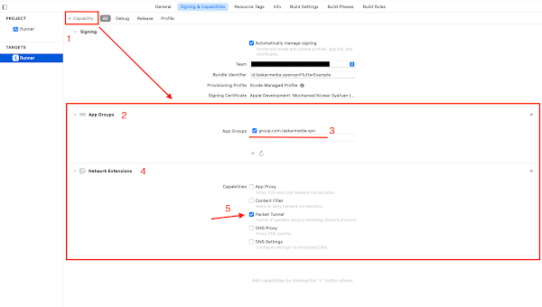
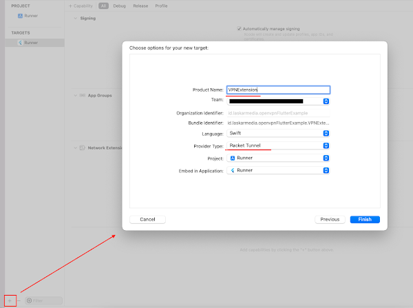
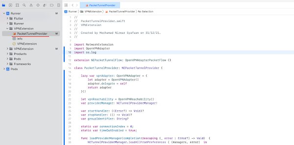
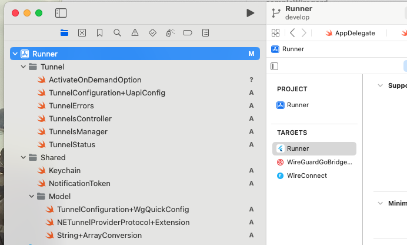
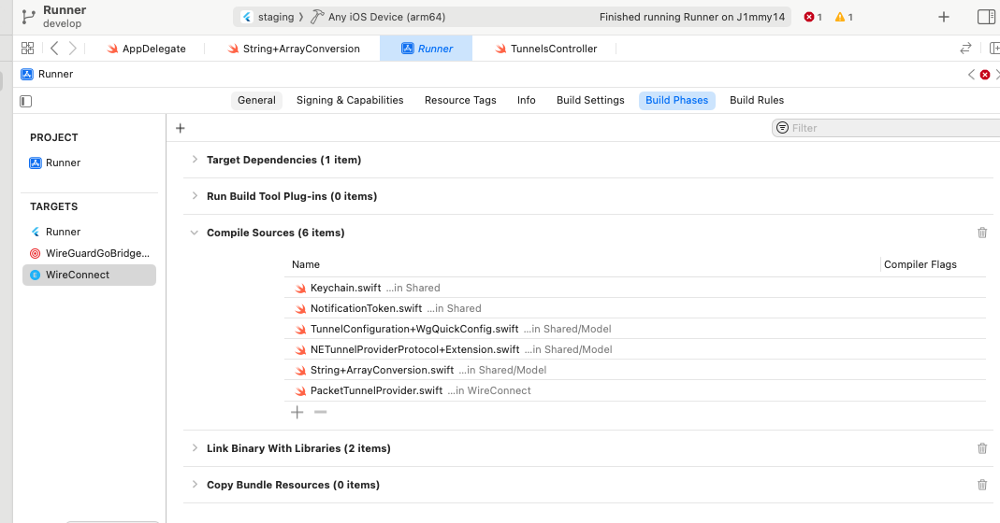
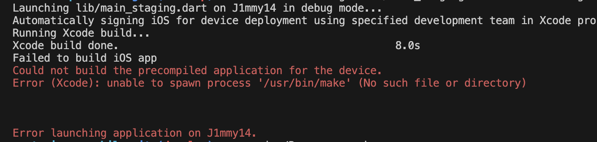

# Wireguard VPN

A Flutter plugin that enables the activation and deactivation of VPN connections using [WireGuard](https://www.wireguard.com/).

### This library depend on:
- WireGuard Android - https://github.com/WireGuard/wireguard-android
- WireGuard Apple - https://github.com/WireGuard/wireguard-apple

### Thank you to:
- https://github.com/Wachu985/flutter_wireguard_vpn: For iOS, I don't think it's good as a package. It needs many steps to set up manually. And I'm not sure it can work on other projects, so I can't contribute to @Wachu Library yet. (It worked well on my project, if you need you can try this my repository)
- https://github.com/WantedSwift/sampleWiregard (If Native can do it, so can Flutter)

# Setup
## Android
- Modify the file /android/app/build.gradle and set the minSdkVersion to 21:
  ``` gradle
  android {                    
    defaultConfig {
        minSdkVersion 21
    }                                
  }
  ```
- To run the application in release mode, you must add a file named ```proguard-rules.pro``` with the following content to the ```./android/app/``` directory:
  ```
  -keep class app.wachu.wireguard_vpn.** {*;}
  -keep class com.beust.klaxon.** {*;}
  ```
- Another option is to add the following to the ```./android/app/build.gradle``` file under the ```buildtypes release```:
  ```
  shrinkResources false
  minifyEnabled false
  ```

## iOS

### I. Add WireGuardKit Swift Package
For run and setup wireguard follow => https://github.com/WireGuard/wireguard-apple#wireguardkit-integration
1. Open your Xcode project and add the Swift package with the following URL:
   
   ```
   https://git.zx2c4.com/wireguard-apple
   ```
   The origin version has issue with SPM (https://github.com/WireGuard/wireguard-apple/pull/21), so please check-out with commit commit: `c11deb941553a27451d8349c98b720c85c88532d``
2. `WireGuardKit` links against `wireguard-go-bridge` library, but it cannot build it automatically
   due to Swift package manager limitations. So it needs a little help from a developer. 
   Please follow the instructions below to create a build target(s) for `wireguard-go-bridge`.
   
   - In Xcode, click File -> New -> Target. Switch to "Other" tab and choose "External Build 
     System".
   - Type in `WireGuardGoBridgeiOS` under the "Product name" - 
     Make sure the build tool is set to: `/usr/bin/make` (default).
   - In the appeared "Info" tab of a newly created target, type in the "Directory" path under 
     the "External Build Tool Configuration":
     
     ```
     ${BUILD_DIR}/../../SourcePackages/checkouts/wireguard-apple/Sources/WireGuardKitGo
     ```
     
   - Switch to "Build Settings" and find `SDKROOT`.
     Type in `macosx` if you target macOS, or type in `iphoneos` if you target iOS.

### II. Add Network Extension
1. Add 2 capabillity on Runner's Target, App Groups and Network Extensions, Look at the image below to get clearer details
    - 
2. Click + button on bottom left, Choose NETWORK EXTENSION, and follow instruction's image bellow
    - 
3. Add Capabillity on VPNExtension, Do it same like Runner's Capabillitiy
    - 
4. Go to Xcode project settings and locate your network extension target and switch to 
   "Build Phases" tab.
   
   - Locate "Dependencies" section and hit "+" to add `WireGuardGoBridgeiOS` replacing 
     
   - Locate the "Link with binary libraries" section and hit "+" to add `WireGuardKit`.
   
5. In Xcode project settings, locate your main bundle app and switch to "Build Phases" tab. 
   Locate the "Link with binary libraries" section and hit "+" to add `WireGuardKit`.
   
6. iOS only: Locate Bitcode settings under your application target, Build settings -> Enable Bitcode, 
   change the corresponding value to "No".

### III. Add Swift code to iOS Project

1. Open VPNExtension > PacketTunnelProvider.swift and copy paste this script `./resources/WireConnect/PacketTunnelProvider.swift`
    - 
2. Open XCode and add all swift files in folder `./resources/Runner/` to Runner (Right click to Runner -> Add File to Runner)
    - 

3. Select your Network Extension, add add the swift file under the folder `Share` folder to `Compile Sources`
    - 

4. Create & Init `TunnelsController` on AppDelegate
    ```diff
    @objc class AppDelegate: FlutterAppDelegate {
    +  var tunnelsController:TunnelsController?
      override func application(
        _ application: UIApplication,
        didFinishLaunchingWithOptions launchOptions: [UIApplication.LaunchOptionsKey: Any]?
      ) -> Bool {
        GeneratedPluginRegistrant.register(with: self)
    +    tunnelsController = TunnelsController()
    +    tunnelsController?.onInit()
        return super.application(application, didFinishLaunchingWithOptions: launchOptions)
      }
    }
    ```

### IV. Troubleshooting
1. You must use iOS Devices instead of Simulator to connect
2. Build or run iOS - `unable to spawn process '/usr/bin/make' (No such file or directory)`
    - 

    **Resolve**
    
    - The main idea is to use `./resource/Scripts/build_wireguard_go_bridge.sh` script in your External Build System configuration:
    1. copy the file in `./resource/Scripts/build_wireguard_go_bridge.sh` to your `ios` folder
    2. Open Xcode - then select your External Build System and change to:
    - Build Tool: `$(PROJECT_DIR)/build_wireguard_go_bridge.sh`
    - Arguments: `$(ACTION)`

    - Directory: `<empty>`
3. Build iOS `clang: error: linker command failed with exit code 1 (use -v to see invocation)`
    - https://stackoverflow.com/a/76865570

# Usage

To use this plugin, you must first add it to your pubspec.yaml file:

``` yaml
dependencies:
  wireguard_vpn:
```

Then, import the package in your .dart file:
``` dart
import 'package:wireguard_vpn/wireguard_vpn.dart';
```

## Activate and Deactivate VPN

To activate or deactivate the VPN connection, use the changeStateParams method of the WireguardFlutterPlugin class. This method takes a SetStateParams object as a parameter, which includes information about the VPN tunnel.

``` dart

final _wireguardFlutterPlugin = WireguardVpn();

void _activateVpn(bool value) async {
  final results = await _wireguardFlutterPlugin.changeStateParams(SetStateParams(
    state: !vpnActivate,
    tunnel: Tunnel(
        name: "MyWireguardVPN",
        address: "192.168.1.1/24",
        dnsServer: "8.8.8.8",
        listenPort: "51820",
        peerAllowedIp: "0.0.0.0/0",
        peerEndpoint: "vpn.example.com:51820",
        peerPublicKey: "PUBLIC_KEY",
        privateKey: "PRIVATE_KEY",
        peerPresharedKey: "PRESHARED_KEY"),
  ));
}
```

## Obtain connection statistics

To obtain statistics of the VPN connection, use the tunnelGetStats method of the WireguardFlutterPlugin class. This method takes the name of the VPN tunnel as a parameter.

``` dart
String initName = "MyWireguardVPN";

final _wireguardFlutterPlugin = WireguardFlutterPlugin();

void _obtainStats() {
  Timer.periodic(const Duration(seconds: 1), (timer) async {
    final results = await _wireguardFlutterPlugin.tunnelGetStats(initName);
    setState(() {
      stats = results ?? Stats(totalDownload: 0, totalUpload: 0);
    });
  });
}
```


## Generate WireGuard VPN configurations
 - To obtain WireGuard VPN configurations for testing, you can visit the [PotonVPN](https://account.protonvpn.com/login) website, register, and generate a configuration under the downloads section. You can also follow the guide on the official [WireGuard VPN](https://www.wireguard.com/) website.

## Contributions

- Contributions are welcome. If you find a bug or want to add a new feature, please open a new [issue](https://github.com/j1mmyto9/wireguard-flutter/issues) or send a [pull request](https://github.com/j1mmyto9/wireguard-flutter/pulls).

## License

This package is available under the terms of the [BSD 3-clause license](https://opensource.org/license/bsd-3-clause/). Please refer to the [LICENSE](https://pub.dev/packages/wireguard_vpn/license) file for more information.
